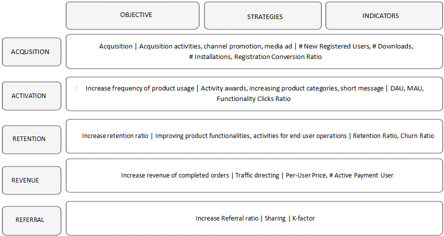

## Building An Indicator Matrix of Data Warehouse

Translated from [滴滴数据仓库指标体系建设实践](https://mp.weixin.qq.com/s/-pLpLD_HMiasyyRxo5oTRQ)

----
### 1. What Is An Indicator Matrix
#### 1.1 The Definition
An indicator matrix is a systematic collection of individual but related indicators. It is used to investigate global picture through individuals and to solve individual problems by global view. The indicator matrix is comprised of indicator and matrix.

An indicator is a quantitative measurement after breaking down the business units, which makes the business descriptive, measurable and breakable. An indicator is an integration of business and data, the fundamental of statistics and an important base for quantifying the  strategic effects.

Indicators can be divided to result-focusing and process-focusing ones.

* **Result-focusing Indicators**
They measure the effects which is resulted from some action conducted by users and the value is retrieved delayed and can't be interfered. Result-focusing indicators are used to monitor data exceptions or the ability of satisfying user demands in specific scenarios.

* **Process-focusing Indicators**
They are produced while the users are doing some actions. We can interfere the values of this sort of indicators and therefore change the final result. The process-focusing indicators are more used to explain why the specific user demands are satisfied or not.

A matrix contains different dimensions which are "mental perspectives" of users to observe, consider or describe things. Dimensions are the core part of an indicator matrix. Indicators themselves have no meanings without dimensions.

Dimensions can be divided to qualitative and quantitative ones. The former is represented by text, taking city, gender, job and etc for example. The latter is represented by values, such as salary, age and etc. We need to group the quantitative dimensions.

#### 1.2 The Life Cycle of An Indicator Matrix

The life cycle contains 4 phases: definition, production, consumption and off-going. We need to do continuous indicator maintenance and quality assurance in the entire life cycle. And we also need to do corresponding data operations in order to increase the reuse of an indicator and to lower the cost of using the indicator. 

#### 1.3 Comprehensive Scenarios of An Indicator Matrix

Basically the indicator matrix is used with specific business scenario. Different indicators and dimensions are usually combined to conduct comprehensive analysis. Analyst is able to observe the overall changes of business so that he can discover and locate problems quickly. One common scenario is decision analysis, where analysts take clear picture of business status through data and conduct strategic decision support. Another one is operations analysis, including operations of users, products and activities, where analysts need various indicator data to locate, analyse and solve problems.

----

### 2. Why to Build Indicator Matrix
* **To measure the quality of business development**
The indicator matrix can tell us the truth of business. It can help us to take a clear picture of business development. The business quality can be measured by indicators so that we can control the business development and solve business problems discovered through data indicators and therefore improve business development in control.
* **To establish the cause-result relationship between indicators**
The relationship between result-focusing indicator and process-focusing indicator can be established through the indicator matrix so that we can trace process indicator through result indicator to locate the kernel causes of a problem.
* **To guide business user's analysis**
The target of an indicator matrix is to establish product assessment system, activiviy effect assessment system and intellectual operations analysis system.
* **To direct the fundamental data construction**
An indicator matrix gives the fundamental data construction a clear direction so that we can get all resources together to avoid omission or lack the process-focusing and result-focusing indicator data.

* **To guide the construction of content products**
An indicator matrix is used integrated with business scenario. Analysts combine multiple indicators and dimensions to comprehensively understand a specific business. The overall business changes can be achieved by changes of the indicator values, which makes analysts to detect and locate problems. 

* **To standardize the specifications of indicator consumption**
An enterprise can employ the indicator matrix to standardize the business and calculation spec of key indicators to unify the business target and therefore achieve the top-down target driven business vision. 
----

### 3. How to Build An Indicator Matrix
Building an indicator matrix generally takes specific scenarios into consideration in perspective of business users and the building is driven by business in terms of top-down strategy. To get a better indicator matrix adapted to certain scenarios, we need to choose appropriate indicators and then employ scientific methodologies.

#### 3.1 Choose indicators scientifically

Two common methods for choosing indicators are indicator classification and OSM model.

Indicator classification means to consider indicators vertically in terms of their meanings. The method classifies indicators from high level to low level according to the strategic targets and organization, and business processes of an enterprise. It breaks indicators hierarchically, generally into three classes: T1, T2 and T3.

* **T1: indicators at the level of enterprise strategies**
Indicators that are used to measure the enterprise-level overall targets achievement, most of which are decision related indicators. T1 indicators generally serve the strategic decisions of company.

* **T2: indicators at the level of business unit strategies**
To achieve the goals of T1 indicators, a company breaks a goal down to business line or group and takes a series of corresponding operational strategies. Usually the T2 indicators represent the consequence of some strategy. They are the core indicators of business lines or groups.

* **T3: indicators at the level of business enforcement**
The T3 indicators are subdivision of T2s to locate the problems detected in T2 indicators. Usually they are the most used indicators in business processes. Since the functional departments have different targets, the focused indicators differ. Generally speaking, the T3 indicators can be used to guide the business work of the front line operators and analysts. The values of the indicators focus more on process and can help the front line staff take corresponding actions.
 

Example: the classification of indicator of deal ratio

An **OSM** model is an important way to confirm core indicators in building indicator matrix. The model can be divided into business goal, strategy and measurement. It considers indicators horizontally in terms of their meanings.
* **O**
What is the purpose of end users to use the product? what demand of the end users is met by our product? The objectives are determined from the Perspectives of end users and business. They should be executable, understandable, intervenible and positively beneficial.
* **S**
What strategies should we take in order to achieve our objectives.
* **M**
what changes of data indicators come because of the above strategies?
 

##### Take Didi's Online Appointment Car as an example. What are the indicators according to OSM model?

* **O**: what are the demand and purpose for end users to use this product?
  * The demand and purpose of end users are to take a taxi conveniently and quickly, and to get to destination securely.
 

##### Then, how do we make end users feel that their needs are met?

* **S**: The strategies that Didi took are:
  * For convenience, Didi provides services through Mini Program and independent APP. Multiple channels are also exposed for end users to take taxi, such as entries in Gode, Weixin, and Alipay. Meanwhile, both source and destination locations can be positioned accurately and intelligently. Besides, functionality of  best path choice is provided to end users as well.
  * For quick response, various types of products are provide according to different demands from end users, such as Express Car, YouXiang, Car Pooling, Taxi and etc. The transit capacity of hot spots is increased during peaks of mornings and evenings to reduce queue time for end users. 
  * For Security, several strategies are employed such as driver permit mechanism, driver compliance audit and driver profile system.

* **M**: We need to define indicators that reflect the above indicators, which can be divided to result-focusing and process-focusing ones.
  * Result-focusing indicators: *Channel Conversing Completion Ratio*, *Passenger Cancellation Ratio*, *Supply-Demand Rate*, and *Driver Service Score*
  * Process-focusing indicators: *#Channel Orders*, *#Channel Completed Orders*, *#Queuing Passengers*, *Passenger Queuing Duration*, *Driver Good Review Rate*, *#Driver Canceled Orders*.
 
After choosing indicators, the most important step comes: choosing analytic dimensions. As mentioned before, dimensions are the core part of indicator matrix. Indicator itself has no meanings withour dimensions. Therefore, dimension selection is conducted combined with actually analyzing business scenarios from data analysis perspectives. Such dimensions include city, business district, channel, date, end user tag and etc.

#### 3.2 Build indicator matrix with analysis model

The book [Lean Analytics](https://www.amazon.com/Lean-Analytics-Better-Startup-Faster/dp/1449335675/ref=sr_1_1?crid=1DI6NQLRBAKQB&dchild=1&keywords=lean+analytics&qid=1617497355&s=books&sprefix=Lean+Analytics%2Caps%2C479&sr=1-1) provides two common methodologies for building indicator matrix. One is the well-known Pirate Metrics Model, e.g.  the **AARRR** Model we often hear about. The Pirate Metrics Model is a classic model for user analysis, which tells us that user growth is systematically throughout all the stages of end user's life cycle: Acquisition, Activation, Retention, Revenue and Referral.
 

##### The AARRR Model

* **Acquisition**
Acquire target user by a variety of promotion channels and through various ways. We assess all channels' promotion effects and then continuously improve investment strategies and reduce customer acquisition cost. The related key indicators include *#New Registered Users*, *Activation Ratio*, *Registration Ratio*, *Retention Ratio for New Customers*, *#Downloads*, *#Installations* and etc.

* **Activation**
The active users are those who really start experiencing the services provided by our product. We need to master the behavior data of these users and monitor the health of our product. This stage mainly measures the behavior of user entering the product, with key indicators such as *DAU*/*MAU*, *Daily Average Duration*, *Launching APP Duration*, *Launching APP Times*.
* **Retention**
Indicators in this stage measure the end users' stickiness and quality. Key indicators include *Retention Ratio*, *Churn Ratio* and etc.
* **Revenue**
Indicators in this stage measure the business value of our products. *Life Cycle Value*, *Per-User Price* and *GMV* are examples of the key indicators.
* **Referral**
Indicators in this stage measure end users self-propagation and our product's word-of-mouth. Examples of the key indicators are *Invitation ratio* and *Fission Ratio*.
 

We may combine **OSM** and **AARRR** in actual business scenarios to systematically choose the corresponding core indicators for different stages.

#### 3.3 Build indicator matrix based on scenarios

Currently, a common abstract model for internet business is "Persons, Items and Fields". That means Users, Products and Scenarios as we talked usually. A more simple explanation is who uses which product in which scenario. There are different combination patterns for different business models.
 
Taking Didi as an example: what persons (passengers) in which fields (terminals such as Native, Weixin and Alipay) uses which items (business lines such as Express/Special) on our platform.

##### 3.3.1 Perspective of Persons

From the perspective of Persons, the questions we concern more are 1)what passengers takes taxi at which time, 2)how long they queue to get a response, 3)how long it takes for them to get on a car, 4)which time it is for them to take taxi in one period, 5)how much money it takes for them to take a taxi, and 6) whether or not they have complains or cancellations. As for indicators, we concerns more about *#Ordering Users*, *#Completion Users*, *Per User Price*, *#Period Completion Orders*, *#Canceled Orders*, and *#Rated Orders*.

##### 3.3.2 Perspective of Items

From the  perspective of items, we pay more attention on the number of dealt orders, the volume of trade, the amount of money that passengers payed. As for indicators, we investigate *GMV*, *Deal Ratio*, *Cancellation Ratio*. And we may detail the indicators along with dimensions of *City* and *District*, and *Level-1 Category* and *Level-2 Category*. Target-based, horizontal or historical comparisons will be leveraged to judge the data effects. 

##### 3.3.3 Perspective of Fields

From the  perspective of fields, we are more concerned about are 1)users from which channels have a large number of hits and/or exposure, 2) which channels bring how many new users, 3) which channels have how many dealt orders, and 3) which channels have how much per-user price. Or 4) what the acquisition or promotion's effect of activity is like and 5) what the conversion ratio is. We need to take appropriate policies according to the scenario based data.

By now we have abstracted the data indicators and analysis dimensions from perspective of Persons, Items and Fields. Let's break down and connect the above 3 types of indicators combining with indicator classification, as follows:

----

### 4. How to Manage An Indicator Matrix

#### 4.1 Problem Analysis

 
Let's review the existing problems from aspects of business, techniques and product.

* **Aspect of business**
unclear indicators and dimensions for specific business analysis scenarios.
Frequent requirement changes and iterations; bloated data report, low data quality.
High cost for business users to look up and confirm data when analyzing business issues.
* **Aspect of techniques**
confusing definition and naming for indicators, non-unique indicators, inconsistent specifications in maintaining indicators;
duplicated production and building of indicators; high calculation cost for aggregating data.

* **Aspect of product**
Lack of support from systematic product. Data flow from production to consumption is not connected at the product level.

#### 4.2 Management Goals

 
* **Technique Goal**
Uniform management of indicators and dimensions, unique naming, calculation specifications and statistical source, normalized dimension definitions, and consist dimension values.
* **Business Goal**
Uniform data output and coverage of scenarios.
* **Product Goal**
Product implementation of indicator matrix management tool; product implementation of indicator matrix content to support decision, analysis and operations, such as Decision Polaris, intelligent operations analysis products and etc.

##### 4.3.1 Business Lines

Here are some principles for business panel definition: Abstract panels at business logic layer and then break down at physical organization layer. The business panels can be further subdivided according to real business scenarios. We recommend at most 3 levels at which the panels are subdivided. Panels at level 1 should be determined according to enterprise picture. Panels at level 2 and lower can be defined regarding the actual business of business lines. Let's take Didi's Travel business as an example. At the layer of business logic, both two-wheel vehicle and four-wheel vehicle business belong to Travel domain so we can abstract the business to form Travel Panel(Level 1). And then, at the layer of physical organization, we can break down the business into panels of Common Services, Online Appointment Car, Taxi and Hitchhiking (Level 2). According to actual business requirements, the Level-2 panels can be subdivided furthermore. For instance, the panel of Online Appointment Car can be subdivided as Single Ride and Share Ride and the Common Services into Bicycle and Enterprise Car.

##### 4.3.2 Normalized Definitions

1. **Data Domains**
A collection that abstracts business process or dimensions which is oriented to business analysis. Here, business processes can be abstracted as atomic behavior events. Indicators can be defined in a business process. And dimensions are the context of measurements. For example in the event of passenger call, *Call Type* is a dimension. To keep the whole system up-to-date, data domain needs to be abstracted and maintained in a long run and the changes to data domains are subjected to change flow. 

1. **Business Processes**
They are the business activities conducted by a company, such as the processes of calling and payment. A business process is non-split.

1. **Periods**
A period is used to define the statistical time range or time point, such as the latest 30 days, natural week, the closing date, and etc.
1. **Decorator Types**
This term is an abstract classification of decorator. A decorator type belongs to a specific business domain. For example, the *Access Terminal Type* in *Log* domain contains decorators such as APP, PC and etc. 
1. **Decorators**
Decorators refer to the business scenario restricted abstractions of indicators other than statistical dimensions. A decorator belongs to a decorator type. For example, there are modifiers such as APP, PC and etc. In the decorator type of *Access Terminal Type* in *Log* domain.   
1. **Measurements/Atomic Indicators**
An atomic indicator has the same meanings as a measure. Based on a specific business event, a measure is a non-split indicator in business definition and has name with clear business meaning, such as Payment Amount.
1. **Dimensions**
Dimensions are the context of measurements. A dimension is a set of attributes that reflect an aspect of business, which is also called an entity. A dimension belongs to a specific data domain. Examples are geographic dimension(contains attributes of country, region, province, city and etc.) and time dimension(which contains layers of year, quarter, month, week and day).

1. **Dimensional Attributes**
Dimensional attributes are owned a dimension. For example, in dimension of *Geography*, *Country Name*, *Country Id* and *Province Name* are called dimensional attributes.

1. **Indicator Categories**
Indicators can fall into 3 categories: atomic, derived and calculated indicators.
    * **Atomic Indicators**
Atomic indicators are based on a specific business event and non-split in business definition. Their names have clear business meaning, such as *#Calls*, *Deal Amount*. 
    * **Derived Indicators**   
Derived indicators refer to one atomic plus multiple decorators (optional) plus period. It is a constraint on indicators in the statistic scope of business. Derived indicators can be categorized as the following two types:
        * **Transactional Indicators**
Indicators that measure business processes, e.g., *#Calls* and *Order Payment Amount*. We need to maintain the atomic indicators and decorators, based on which they are created.
        * **Cumulative Indicators**
Cumulative indicators are statistics of some states of entities (drivers, passengers), e.g., *#Total Registered Drivers* and *#Total Registered Passengers*. We also need to maintain the atomic indicators and decorators, based on which they are created. Generally the corresponding time period refers to "a certain current time since origin".
    * **Calculated Indicators**
These indicators are a calculation based on transactional or cumulative indicators. Calculated indicators mainly include ones of ratio type, of proportion and of aggregative.

##### 4.3.3 Model Design

We employ the methodology of dimensional modeling to build our model. The fact tables of basic business details store dimensional attributes collection and measurements/atomic indicators, and the fact tables of analytical business aggregation need to store them by the indicator types (unique or non-unique). That is, non-unique indicator aggregation fact tables store statistical dimensional collection and atomic or derived indicators, while the unique indicator aggregation fact tables only store the collection of statistical tags for analytical entity.

In terms of physical implementation, the indicator matrix is built mainly guided by the hierarchical architecture of data warehouse model. As the core management layer, DWM (data warehouse model) layer is used to store Didi's indicators data.

#### 4.4 Metadata Management of Indicator Matrix

##### 4.4.1 Dimension Management
 
This includes management of basic and technical information, which should be maintained by different role respectively.

* The basic information refers to the business information of dimensions, which is maintained by business managers, data product managers or BI analysts. The information contains dimension's name, business definition and business category.
* The technical information means the dimension's data information, maintained by data developer. The information contains: 1) is there a dim table(i.e. an enumeration dimension or the one with independent dimension table), 2) is it a date dimension, 3) the English and Chinese names of the corresponding code, 4) the English and Chinese names of corresponding name. If there is an independent physical table for a dimension, we need to bond the management information with the table, setting the corresponding fields for code and name. Else, if a dimension is enumerated, we need to fill the corresponding code and name. A unified management of dimensions is conductive to the further standardization of data tables and makes business users easy to use. 

##### 4.4.2 Indicator Management 

This contains management of basic, technical and derivation information, maintained by different role respectively.

* The basic information refers to the business information of indicators, maintained by business managers, data product managers or BI analysts. The information contains indicator's ownership (business panel, data domain and business process), description (name, English name, definitions, description of statistic algorithm and indicator type (unique or non-unique )) and business scenario (analytic dimensions and scenario description).

* The technical information means indicator's physical model, maintained by data developers and including physical tales and fields information.

* The derivation information corresponds to information of derived or calculated indicators and is related to information of data applications and business scenarios. The relationship benefits business users to find out in which data applications or other indicators the interesting indicators are used, that is, providing the capability of linkage analysis and data source tracing.

Atomic indicator = ownership + description + business scenario
Derived indicator = period + decorator collection + atomic indicator
The decoration types contain type description, statistical algorithm description and optional data source.

#### 4.5 Process of Building An Indicator Matrix 

##### 4.5.1 Modeling Process

The modeling process is to guide engineers to abstract and classify indicators involved in the requirement scenario from the business perspective, unify the business terms, reduce communication cost and avoid duplicated construction of follow-up indicators.

The analytic data entities are a physical collection of aggregative fact tables in model architecture. At the business logic level, we abstract and accumulate the indicator matrix in terms of business analytical objects or scenarios. Didi Travel conducts topic abstraction according mostly to analytical objects. Examples are drivers, security, physical check, cities and etc. Indicator classification is conducted according to the real business processes, e.g. driver transaction indicators, driver registration indicators, driver growth indicators and etc.
 
The basic data entities are a physical collection of detail fact tables and basic dimensional tables is model architecture. At the business logic level, the entities are abstracted involving the business processes in practice to make it capable to restore the core business processes. Examples are driver compliance, passenger registration and etc.
 

##### 4.5.2 Development Flow

The development flow is a technical guidance for engineers to develop, maintain and quality-control the indicator matrix. The flow can also be a communication bridge between data warehouse developers and data product managers/data analysts.

#### 4.6 Building An Indicator Matrix Graph

##### 4.6.1 Introduction to An Indicator Matrix Graph

Indicator matrix graph, also called data analysis graph, is designed to abstract analysis entities from real business scenarios and sort out the business categories, analysis indicators and dimensional collection.

**Method:**
The graph is built through perspectives of business and end users. It needs to connect business and data closely and organize indicators hierarchically.
 
**Purpose:**

* **For business user:**
It is convenient to find the required indicators and dimensions quickly. It should accumulate the indicator matrix through business scenarios and be able to resolve business user's data requirements fast.
* **For developers:**
The graph benefits developers to design the indicator production models, establish boundaries of data content, iterate and quantize data matrix construction and implement the products of data assets.
  

##### 4.6.2 Model of An Indicator Matrix Graph

##### 4.6.2 Instance of An Indicator Matrix Graph

----

### 5. Product Implementation of An Indicator Matrix

The product suites related to indicator matrix should be implemented according to corresponding stages of life-cycle of the matrix. Through the product suites, we get an interconnected data flow and realize the management of indicator matrix on the aspects of unification, automation, normalization and flow processing. The essential goal of building indicator matrix is to serve business and bring data value to achieve data-driven business value, so the core dicipline is "light standard, heavy scenario, and changing from administration to service style".By integrate tools, products, techniques and organizations, we should be to increase the data usage frequency of business users and speed up business's innovation and iteration.

In the above graph, Indicator Dictionary is a product strongly related to indicator matrix methodology. It's aim and value:

* Transform indicator management rules from methodology to enforcement. Automatically generate normalized indicators, solve the problems of confusion of indicator naming and duplicated of indicators, and remove data ambiguity.

* Provide uniform indicator specification and meta-data information.
 
')

----
### 6. Summary

This article gives an overall introduction to the methodology of Didi's indicator matrix construction and the development of the underlying tool products. Currently we have automated connection between indicator dictionary and development tool. In the following plan, we will automate the connection with data consumption products by providing data services through DataAPI. The methodology and tools of indicator matrix construction has been popularized in Didi Group Inc. Departments such as Online Appointment Car, Common Services and Car Services have started using them. By now there are 5000+ indicators in our indicator matrix, which have covered company's core business panels, 88 data domains, 385 business processes and 52 business scenarios. The methodology and tools will be continuously improved.