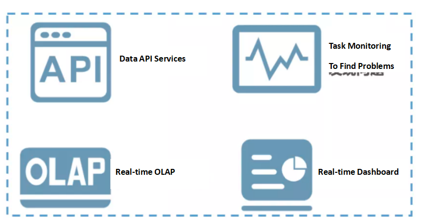
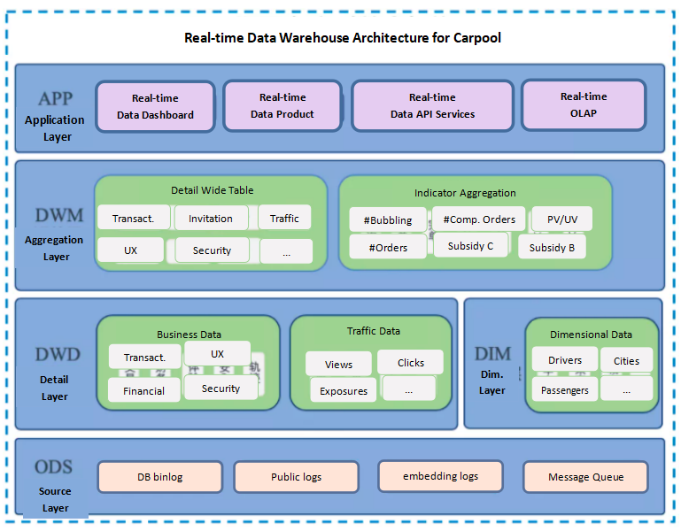
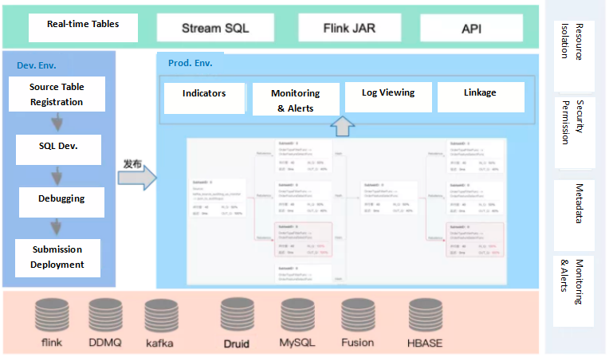
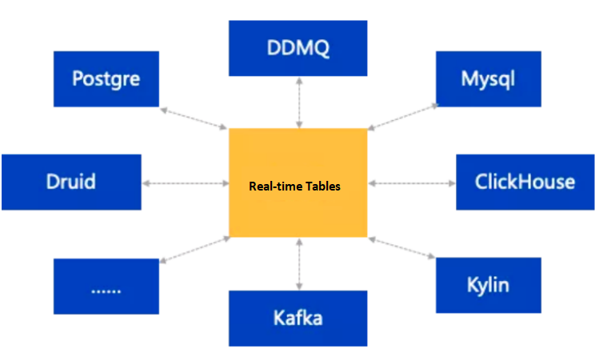
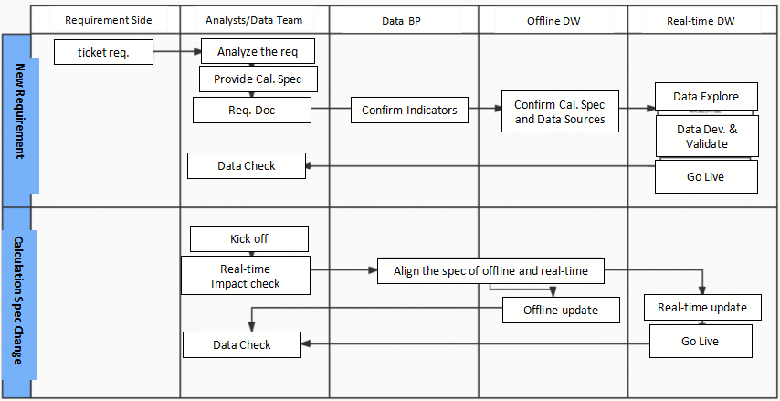
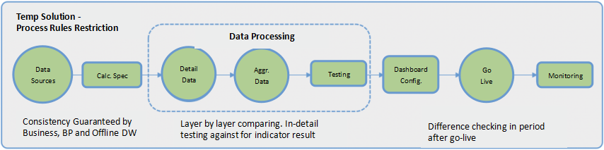
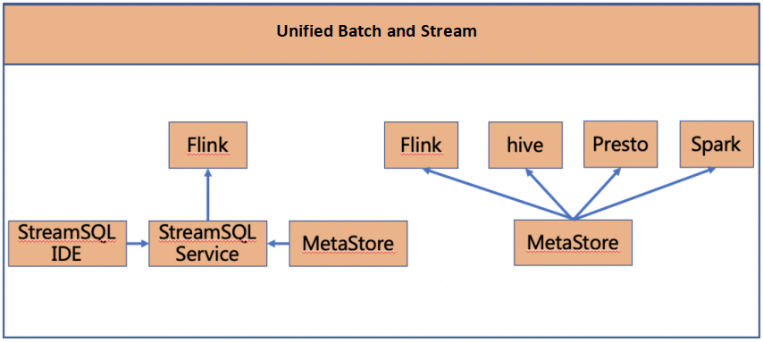

## Building a Real-time Data Warehouse
Authors: Pan Cheng, Zhu Feng

Translated from [实时数仓在滴滴的实践和落地](https://mp.weixin.qq.com/s/PdxjNQd7SNx1POv6fVKVmA)
Translator: Zyloh

----
### 1. Why to Build a Real-time Data Warehouse
As the Internet economics has entered the second half, the timeliness of data becomes more and more important to company's lean operations. Market is like another battle field. It would be very helpful for enterprise to timely adjust its operation strategies if we can extract valuable information in realtime from the huge volume of data produced daily. 

Besides, from the perspective of intelligent business, the resulting data represent feedback from end users, which makes the timeliness of getting results become extremely important. The quicker we get data feedback, the faster our company make decision and the better we improve our products. The real-time data warehouse plays an irreplaceable role here.

#### 1.1 To deal with the disadvantages of traditional data warehouse

The term real-time data can easily confuse people from the view of data warehouse building. According to the traditional experience, one important functionality of data warehouse is storing history. Generally speaking, data warehouse is expected to store data of a business product since the first day it goes online, and then keep storing till right now. However, the real-time stream processing techniques put stress on current process status. By reviewing the experiences from top companies and Company's practice of the techniques, we try to direct the construction of real-time data warehouse to the following target: combine the data warehouse methodologies and real-time techniques to resolve the problems in the offline data warehouse that it cannot remedy due to its low timeliness.  

In details, following are some key reasons we need to build real-time data warehouse at the current stage.

* The company businesses have more and more urgent demands for timely data. They need real-time data to support decision making.
* There is no specification for real-time data construction. The data have low availability and cannot form data warehouse system. A lot of resources are being wasted.

* The data platform tools are more supportive for development of real-time data warehouse than before so we can spend lower cost.

#### 1.2 Scenarios where real-time data warehouse applies

* **Real-time OLAP**: 
Actually OLAP itself is a key challenging subject in field of data warehouse. Thanks to company's Big Data Architecture Team,  By employing their stream sql tool based on Flink calculation engine, and messaging mid-wares such as Kafka and ddmq (self-developed), and OLAP databases such as Druid and ClickHouse, we significantly increase the timeliness of our data warehouse, making it capable to do better real-time analysis.

* **Real-time Data Dashboard**: This is the main scenario of real-time requirements. Such requirements include 1) big screen real-time presentation for orders and coupon consumption on "Sharing Car Day", 2. kernel order indicators display by minutes on opening day for Carpool cities, real-time display for resource investment and profits, and etc.

* **Real-time Business Monitoring** Lots of kernel business indicators of Trip Department need to be monitored in real time, such as security, financial and complain processing indictors. 

* **Real-time Data Services** Due to the business barriers between different business lines, it is hard for data warehouse developers to get familiar with all business lines inside company. So we need to cooperate closely with corresponding teams of business lines in terms of data processing and data retrieving. Data warehouse team provides data supports to business owners by exposing real-time data services.

----
### 2. An Example of Real-time Data Warehouse
My data team and I am very proud having a deep cooperations with Carpool business line. Together with meeting the real-time data requirements from our business partner, we kept enriching the content of our real-time data warehouse. By several iterations, we have, in the main, met vast kinds of real-time requirements from the business team. And we have established the initial real-time data warehouse for Carpool Business. We also have finished the overall layering, including detail and aggregation data layers. The DWD layer has been unified, which decreases the cost for big data resources and increases the reusability of our data. Rich data services can be provided to outside. 

**Architecture of a real-time data warehouse:**

From above we can see that the real-time data warehouse is very similar as its corresponding offline data warehouse. Both have been split for several layers, such as ODS, DWD, DWM and even APP layer. Their naming pattern may be the same. But they have many differences if we compare the architectures carefully.   

* Compared with its offline counterpart, the real-time data warehouse has less layers.

* From the existing experience of offline data warehouse construction, the content at the data detail layer will be very rich, so generally a layer of light summary layer will be included in data warehouse in addition to processing detail data. Besides, the application layer is inside the offline data warehouse, while in real-time data warehouse, the data in that layer are stored in the media of application system, so we can separate that layer from other tables of data warehouse. 

* Advantage for less construction of application layer: result data would be lagged more for every another layer when processing. 

* Advantage for less construction of summary layer: In summary statistics, in order to tolerate the delay of some data, some artificial delays may be created to ensure the accuracy of data. For example, when counting the data in the order events related to cross day, you may wait until 00:00:05 or 00:00:10 to make sure that all the data before 00:00 have been accepted. Therefore, if there are too many levels in the summary layer, the data delay caused by human will be aggravated.

* The data source storage of real-time data warehouse is different from its offline counterpart.
* Currently, the whole offline data warehouse is created based on Hive tables. However, when building real-time data warehouse, we need to use different types of media to store the same table. For example, in common cases, detailed data or summary data will be stored in Kafka, but dimensional information such as cities and channels need to be stored in databases such as HBase, MySQL or other kV storage.

**Now let's discuss the details for each layer in the data warehouse architecture of Carpool Business:**

#### 2.1. ODS layer

According to the specific scenarios of Carpool Business, the data sources include the *binlog* logs related to orders, the *public* logs related to bubbling and security, and the embedding point logs related to traffic. Part of these data has been collected and written into data channels such as Kafka or ddmq, while others need to be collected by self-developed synchronizing tools. All the data are eventually written to Kafka storage in terms of the construction spec of Carpool data warehouse ods layer.  

**Naming Spec**: there are 2 types of real-time data sources in ODS layer.

* One is the DDMQ or Kafka topic which has been automatically produced during offline collection. The names of this type of data are generated automatically by the collecting system according to the system's rule: cn-binlog-{database name}-{database name}, e.g.,  cn-binlog-ihap_fangyuan-ihap_fangyuan 
* Another type of data needs to be collected and synchronized by ourselves to Kafka topic. the naming rule for production topic is similar to that in offline. In ODS it is: realtime_ods_binlog_{name of source database/table}/ods_log_{log name}, e.g., realtime_ods_binlog_ihap_fangyuan

#### 2.2 DWD layer
The modeling is based on the business processes of Carpool. We created the corresponding detail layer fact table with finest granularity according to the characteristics of each business processes. Considering how the Carpool analysts explore data on offline side, we made some of the important dimensional attribute fields redundant to complete the wide table processing. Afterwards, modules like transaction, financial, UE, security and traffic were established complying with the key demands for real-time data of the current Carpool businesses. The data in this layer were from ODS and we implemented the ETL jobs via the Stream SQL provided by the Big Data Architecture Team. The binlog data was processed mainly by data cleaning and fixing data shift and data disorder. Necessary Stream Joins will be carried out for multiple ODS tables. For data of traffic logs, we developed general ETL processing and filtered data related to Carpool scenarios to make unstructured data structured and realize data diversion. in addition to the message queue Kafka, we also wrote the data into Druid database in real time to support queries for detail data and to serve as processed data source for simple data aggregations.

**Naming Spec:** The tables in DWD layer are named using English letters with lower case, with words separated by underlines and the total length should be less than 40. Besides, the names should obey the following rule: realtime_dwd_{business/pub}_{abbr. of data domain }_[{abbr. of business process }]_[{abbr. of customized table naming label}]

* {business/pub}:reference business naming rules
 
* {data domain abbr.}:reference section of data domain categorization
Example: realtime_dwd_trip_trd_order_base  
* {abbr. of customized table naming label}:Entity names can be abstracted from business names based on data warehouse transformation and integration. The name should describe the exact meanings of business which the entities represent.

#### 2.3. DIM Layer

* The public dimension layer, based on the methodology of dimensional,  modeling established dimensions that are consistent in the whole business process to reduce the risk of not unified calculation specifications and algorithms. 
* The data in this layer come from 2 sources: one is the ODS data that are real-time processed by Flink programs and another is retrieved from the output of offline data warehouse.
* The dimension data in this layer are stored using MySQL, HBase and fusion( a KV storage engine self-developed). MySQL stores dimensions with less rows. fusion stores dimensions that have small sized single row but high QPS, so that we can lower the memory resources cost. In the scenarios which query for large amount of data and is insensitive to the changes of dimensional data, we can store the dimension data into HBase.

**Naming Spec:** The tables in DIM layer are named using English letters with lower case, with words separated by underlines and the total length should be less than 30. Besides, the name should obey the following pattern: dim_{business/pub}_{dimension definition}[_{abbr. of customized naming label}]
* {business/pub}: reference business naming
* {dimension definition}: reference dimension naming
* {abbr. of customized table naming label}:Entity names can be abstracted from business names based on data warehouse transformation and integration. The name should describe the exact meanings of business which the entities represent.
Example:dim_trip_dri_base

#### 2.4 DWM Layer
The aggregation lay of Carpool real-time data warehouse shares many concepts but there are a lot of differences in terms of technical implementations.

**First**, for some common indicators, such as PV, UV, or those of order business process, we need to carry out unified calculations at the aggregation layer to ensure that the indicator specifications are consistently completed in one fixed model. For some special indicators, we need to consider their reusability and restrict them to an unique time field. In the mean time, the time field needs to be aligned to that of other indicators at the most extent. For example, the indicator #Excepted Orders and other indicators in transaction domain should have aligned time fields.

**Second**, multi-dimensional aggregation need to be conducted in Carpool aggregation layer. This is because a real-time data warehouse is topic oriented. Each topic may concern different dimensions, so it is necessary to summarize the data according to the dimensions related to that topic. and finally we can calculate the aggregation indicators that are demanded by business users. In practice, the PV-like indicators were aggregated using Stream SQL, taking 1 minute as the minimum aggregation unit, and then were accumulated along time dimension based on that unit; while for the UV-like ones, we employed Druid database at the indicator aggregation containers and implemented the accurate or non-accurate unique aggregations according to the business requirements for indicators on timeliness and accuracy. 

**Third**, the derived dimension need to generate as well. In the processing of aggregation indicator related to carpool coupons, we leveraged the version control mechanism of HBase to create the chaining table for derived dimensions, which then was joined with event stream to get the accurate dimension for real-time data.

**Naming Spec:**  The tables in DIM layer are named using English letters with lower case, with words separated by underlines and the total length should be less than 40. The follow rule should also be obeyed: realtime_dwm_{business/pub}_{abbr. of data domain}_{abbr. of main granularity}_[{abbr. of customized table naming label}]_{abbr. of statistical time range}:
* {business/pub}:reference business naming
* {abbr. of data domain}:reference section of data domain categorization 
* {abbr. of main granularity}:abbr. of the main granularity or data domain. It is also the main dimension in composite keys.
* {abbr. of customized table naming label}:Entity names can be abstracted from business names based on data warehouse transformation and integration. The name should describe the exact meanings of business which the entities represent.
* {abbr. of customized table naming label}]_{abbr. of statistical time range}: 1d: daily delta, td: daily accumulation (total); 1h:hourly delta, th: hourly accumulation (total); 
Example: realtime_dwm_trip_trd_pas_bus_accum_1min

#### 2.5 APP Layer

The main task of this layer is to write real-time aggregation data into databases of application system. The databases include the Druid database (in addition to application data, the database can also store detailed data for calculations of aggregation indicators) for big screen display and real-time OLAP, the Hbase database for real-time data API services, and mysql/redis for real-time products.

**Naming Spec:** No restrictions in this layer because of the particularity of real-time database.

----
### 3. Achievements of Carpool Real-time Data Warehouse
By now, we have created total 5 modules for business line of Carpool, including Growth, Transaction, Experience, Security and Financial. These modules cover 40+ real-time dashboard and all kernel business processes of Carpool. The data error of real-time from offline is < 0.5%. The real-time data warehouse is an excellent helper for Carpool Business Line's data analysis. Our data warehouse supports Carpool with real-time data for coupon distribution strategy dynamic adjustment, driver security monitoring, and real-time order trending analysis, which therefore increase the timeliness of strategies. Besides, the real-time indicators are able to update the statistical spec and complete the consistency check with offline data in time corresponding to business requirements. As a result, the development efficiency of real-time indicators and the accuracy of real-time data are dramatically improved. Our efforts give a powerful support on methodology and practice for large-scale constructions of real-time data warehouse inside company.

----
### 4. The Strong Dependency of Real-time Data Warehouse on Data Platform

Currently, the implementation of real-time data warehouse inside company is strongly dependent on the features of Data Platform, which include StreamSQL scripting, the StreamSQL IDE and task maintenance components in Data Dream Factory, and metadata functionality for real-time data sources. 

#### 4.1 StreamSQL Based Development for Real-time Data Requirements

StreamSQL is an improved product developed by Big Data Engine Department based on Flink SQL .
**There are several advantages with StreamSQL:**

**Descriptive language:** Business team don't have to concern about the underlying implementation. They just need to describe the business logic.
**Stable API:** SQL syntax doesn't need to change while the version of Flink is updated.
**Easy troubleshooting:** The script has strong logic. Users are able to investigate the error as long as they understand the syntax.
**Unified batch and stream:** HiveSQL and SparkSQL are used for batch processing. And if Flink task is developed with SQL as well, then the tasks of batch processing and stream processing can share with each other in aspects of syntax and other features. Finally we can unify them. 

**StreamSQL's improvements from FlinkSQL (before version 1.9):**

* **Improved DDL:** StreamSqL has integrated upstream and downstream with different storages such as Druid, HBase and etc. Users can describe upstream or downstream with just creating one source. 
* **Built-in parsing of message format:** Once starting consumption, we need to extract data from sources. However usually the data format are complicated. For example it is different to parse binlog since its format differs by user. StreamSQL has built-in functions for extracting names of databases, tables and columns. The functionality of de-dup is also built inside StreamSQL. The only thing left for users is to create sources with type of binlog. As for data of business log, StreamSQL have functions for extracting log heads, business fields and conform Map objects. And for json data, users just need to set necessary data fields and don't have to define UDF.

* **Extend UDX:** StreamSQL has rich built-in UDX. For example, it extents JSON and MAP, which have frequent usage in Company's business. StreamSQL also supports customized UDX, where users import jars containing their UDF. StreamSQL is compatible with Hive UDX. E.g., if the original task is of Hive SQL, then it takes few changes for users to transform it into a real-time task, which benefit batch-stream integration.

**Extended Join Features:** 
**①** TTL based dual-stream join: sometimes in stream calculation task, the data in join operation has long time range. For example,  in Carpool business, the time range from order offering to receiving may last for around 1 week. If the join operation for the data cannot be carried out in memory, we usually put the join data into a status and then implement a window function using TTL. The data will be cleaned up when expired. 
**②** Join for dimensional tables: the dimensional tables allow format of HBase, KVStore and Mysql, and the types of join can be inner, left, right and full join.   

#### 4.2 StreamSQL IDE and Task Maintenance Based on Data Dream Factory

**StreamSQL IDE:**
* **Provides frequently used SQL templates:** we don't have to develop stream SQL from scratch. In order to get what we want, We just need to choose a SQL template and make some modifications from it.
* **Provides UDF library:** if we don't know what a library means and how to use it,  we can search the IDE for it and we can find the usage and examples. The IDE also features on syntax check and intellisense.
* **Provides the functionality of online debugging:** we can upload local testing data or sample small size of source data in, e.g., Kafka for debugging. This functionality is very important for stream calculation task. Version control is also supported by the IDE. we can revert the current version of a task during the continuous upgrading of business version. 

**Task Maintenance:** it can be divided into the following 4 features:

* **Log Retrieving:** Flink UI has bad UX for Querying logs. So my company collected Flink task logs and store in ES. Users can easily search for the logs through a web UI. 
* **Indicator Monitoring:** again, the UX of Flink UI frustrates users when investigating numerous Flink indicators. Therefore an external report platform was created, through which we can monitor our indicators.
* **Alerting:** we need to balance different kinds of alerts. For example, since restart alerts have many types, we can make the balance by setting the threshold of daily times of the alerts for a single task. the alerts also contain types of availability (kill, start), delay, restart, frequent failure of checkpoint(e.g. unreasonable cycle configuration for checkpoint) and etc.
* **Linkage Track:** real-time calculation tasks can have a long chain. There may be 4 or 5 nodes from data collecting, through message channeling, through stream calculating, and to the downstream storage. Disasters would happen if we could not track the linkage. For example, if we find the traffic of a stream task increase dramatically, we need to check whether the the topic the task is consuming increases its traffic, whether the topic's upstream does so, whether an improper batch operation happens in the upstream database or whether some business is generating too many logs. In order to find the original issue, we need to track this problem from different directions, downstream ot upstream or upstream to downstream. 

#### 4.3 Metadata-ization for Real-time Data Sources Based on Data Dream Factory (meta-table)
Data Dream Factory imports the topics as real-time tables, and then leverages metastore to manage the metadata.  All DDL processes are managed in real-time development. For real-time data warehouse, metadata-ization can consolidate the achievements of real-time constructions, and helps better implementation for future data warehouse modeling.

Currently, Data Dream Factory supports metadata-ization for the following real-time data sources: Postgre, DDMQ, Mysql, Druid, ChickHouse, Kylin and Kafka.

----
### 5. Consideration on Challenges and Solutions 
At present, the real-time data warehouse has begun to take shape, but we cannot ignore the problems it faces.

#### 5.1 The development spec of real-time data warehouse
**Problem:** in order to quickly respond business requirements and to comply with the requirement development flow of data warehouse, it is urgent for us to build a specification white book for real-time data developments. The white book should include spec of requirement assignment, calculation algorithm clearing, data development, task deployment, task monitoring and task guarantee. 

**Current solution:** Led by data BP, we have created a set of development specification for real-time data indicators:

**Normal Flow:** The business side puts forwards the requirement and then the analysts deal with the requirement, provide calculation spec and compile requirement document. Next, data warehouse BP checks the calculation spec with the offline data warehouse team, and provides offline hive tables to the real-time data warehouse team. Then the latter explore data based on the tables, implement the real-time data requirement based on the real-time data warehouse model, and execute self-checking through the offline calculation spec. After the analysts carry out a double-check on the data, the development team put the required indicators online. 

**Calculation spec change -- proposed by business side:** Once the business side raises a calculation spec change, the data warehouse BP checks whether it has impact on real-time indicators. If yes, he/she aligns the calculation specs of offline and real-time indicators and then provide the updated spec and data source tables to both team. The real-time team will first put the updated data on to testing dashboard and then switch to the product one if it passes the checking of business side. 

**Disadvantages:** 
* In building a new real-time data warehouse, the initialization is very difficult, where there are a lot of couplings between the real-time and offline team. We need to confirm the indicator calculation spec, the data sources and do huge volume of development and testing work.
* Besides, a better notification system is necessary for a calculation spec change, which, for now, is still judged artificially. 

#### 5.2 Consistency guarantee for offline and real-time data
**Current Solutions:** the consistency of data sources and calculation spec are guaranteed together by business owner, real-time BP and offline counterparts. We compare data with offline layer by layer when processing data. We also execute in-detail testing against indicator result. Once going online after data checking passed, the data are checked with offline according to the iteration period of offline data warehouse. 

Ideas to be implemented: the consistency of indicator calculation spec can be ensured by integrating the indicator management tool. And in order to reduce the cost of data comparing, Data Dream Factory can be extended by adding functionality of comparing offline real-time data in the indicator processing. 

----
### 6. Expectation: Unified Batch and Stream
Although Flink supports the unified batch and stream, my company hasn't yet. We hope to unify the batch and stream  firstly from product level. By improving the construction of meta-ization, all metadata can be unified in one single company-wide MetaStore. The metadata not only in Hive and kafka topic but also in the downstream storage such as HBase and ES can be defined in the MetaStore. All the calculation engines such as Hive, Spark, Presto and Flink queries the same MetaStore to ensure the consistent effect for all SQL developments. The batch and stream processes can be separated by judging the source consumed by SQL is a table or a stream. Thus we are able to unify the batch and stream processing from the product level.

